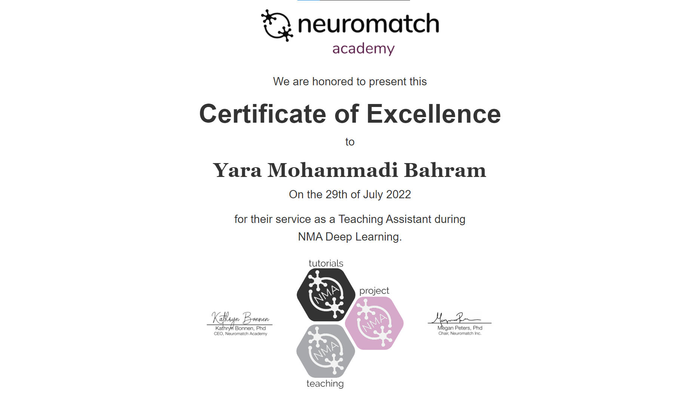
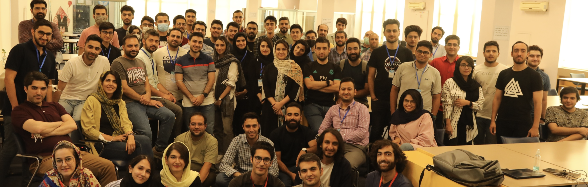

<h3 id="publications">Bio</h3>

I am currently a PhD candidate at École de technologie supérieure (ÉTS), Montréal. There, I am working on Deep Learning around Vision applications with Prof. [Éric Granger](https://www.etsmtl.ca/en/research/professors/egranger) and Prof. [Mohammadhadi Shateri](https://www.etsmtl.ca/en/research/professors/mshateri). My focus is on adapting and optimizing generative models. I particularly build solution for customized and efficient generation in multimodal and low-data settings.

Previously, I obtained a Masters degree in Artificial Intelligence (AI) at the [University of Tehran](https://ut.ac.ir/en) in Iran. There I worked as a research assistant in the Machine Learning (ML) Lab under the supervision of [Dr. Amin Sadeghi](https://scholar.google.com/citations?hl=en&user=Viogmi8AAAAJ&view_op=list_works&sortby=pubdate) on foundational Deep Learning (DL) and explainability in vision applications. My Master's thesis was titled "When and where to perform regularization in the training of deep learning models?". I obtained my Bachelor's degree from the [Isfahan University of Technology](http://english.iut.ac.ir/) where I studied Computer Engineering. 

--------------
<h3 id="cv">CV</h3>
Download my full CV [here](../files/CV_without_paper_links.pdf). (Last update: 22 February 2024)

--------------

<h3 id="publications">Publications</h3>

  <!-- Uni-DAD -->
  

    
    

      
Uni-DAD: Unified Distillation and Adaptation of Diffusion Models for Few-step Few-shot Image Generation

      
Y Bahram, M Desbos, M Shateri, E Granger

      
<em>Under Review</em>

      

        <a href="https://arxiv.org/abs/2511.18281" target="_blank" rel="noopener">arXiv</a>
      

    

  

  

  <!-- DogFit -->
  

    
    

      
DogFit: Domain-guided Fine-tuning for Efficient Transfer Learning of Diffusion Models

      
Y Bahram, M Shateri, E Granger

      
<em>AAAI 2026</em> (2026)

      

        <a href="https://arxiv.org/abs/2508.05685" target="_blank" rel="noopener">arXiv</a>
      

    

  

  

  

    
    

      
Fairness auditing through the lens of Counterfactual Explanations

      
Y Deldjoo, M Varasteh, YM Bahram, N Tintarev

      
<em>Draft Manuscript</em> (2022)

      

        
Abstract

        

          A wide variety of fairness metrics and eXplainable Artificial Intelligence (XAI) approaches have been proposed in the literature to identify bias in machine learning (ML) models that are used in critical real-life contexts. In this paper, we present an approach that ties the evaluation of the fairness of machine learning models to the <em>expense</em> (or conversely the simplicity) of generating counterfactual explanations (CFE). Considering the relative importance of each feature class towards obtaining the desired outcome, we attribute different scores to each feature value and propose model-agnostic concepts of Qualification and Effort, respectively, indicating the candidate's strength and the adjustments that must be made to the candidate's profile in order to alter the classifier's output. To ensure a fair comparison, we further group candidates based on their Qualification scores. We additionally utilize KL-divergence to capture the complex disparities between distributions of the CFE Efforts among the sensitive groups. We empirically evaluate fairness among different sensitive classes for several classifiers on two real-world datasets. We find that the majority of classifiers exhibit unfair propensities towards the minority groups. However, some models exacerbate the bias more than others. Also, we find that classifiers tend to behave differently for members of each Qualification group. Our results show that our method can successfully be used for fairness evaluation of classification models based on CFEs.
        

      

    

  

  

  <!-- Post-Regularization -->
  

    
    

      
Overfitting is not a dead-end: A survey and outlook on post-training regularization

      
YM Bahram, MA Sadeghi

      
<em>Draft Abstract</em> (2023)

      

        
Abstract

        

          Machine learning (ML) relies heavily on regularization, as it allows better generalization to unknown data, even with imperfect optimization procedures and datasets. There are, however, major problems with regularization that have surprisingly received little attention so far. Regularization methods traditionally <strong>avoid</strong> overfitting. But when overfitting happens, they usually fail to fight it and cannot bring the machine learning model out of its adverse situation. As a result, the stage of overfitting is taught of as a dead-end in the ML community. This idea has consequently forced the system designers to perform expensive hyperparameter searches, retraining the model from scratch every time with new configurations. It has also led to similar complications in the ever-changing dynamic usages of static pre-trained models. Defying the overfitting dead-end misconception, we argue that even a model that is overfitting includes useful information about the task at hand, and being able to adjust the regularization strength by using this information after the overfitting further solidifies this suggestion. This process ideally requires the disentanglement of the regularization process from the initial stages of the training phase and being able to apply the regularization as a post-processing step with low cost. This would allow adjusting the regularization strength of pre-trained models efficiently, which is an increasingly viable concept given the prevalent use of large neural networks today in many domains and applications. There already are implicit and explicit traces of this idea, which we call <em>Post-Regularization</em>, in a wide range of existing works from several domains. However, there exists no unified view of this concept. In this work, we formalize <em>Post-Regularization</em>, and provide a novel taxonomy of regularization, from the perspective of <strong>when</strong> the regularization is applied with respect to the model training to help bring together the ideas that can potentially be further explored in this area. We hope that this work attracts more attention to <em>Post-Regularization</em> and provides a foundation for future related work.
        

      

    

  

--------------

<h3 id="teaching">Teaching</h3>

#### Teaching Assistant for Graduate University Courses
_University of Tehran, School of Electrical and Computer Engineering, 2021-2023_

- Deep Generative Models (Lead TA) - Fall 2022
- Machine Learning (TA) - Fall 2022
- Advanced Deep Learning (TA) - Spring 2022
- Data Analytics and Visualization (Lead TA) - Fall 2021

-----------------

#### Teaching Assistant at the Neuromatch Academy Deep Learning Summerschool
_Online, 2022-07_

I was selected as TA for full-time supervision on the learning of 16 students from
different countries, and leading 2 research group projects during 3 weeks. The topics covered a wide and comprehensive range of Deep Learning subjects ([Curriculum](https://deeplearning.neuromatch.io/tutorials/intro.html)).

-----------------

#### Mentor at HooshBaaz Data Analytics Summer Bootcamp
_University of Tehran, School of Electrical and Computer Engineering, 2022-07_

Group collaboration with 7 other mentors for educating 80 students during 14 data science workshops. ([LinkedIn](https://www.linkedin.com/company/ut-openai-summerschool/), [Github](https://github.com/HooshBaaz/2022_DataAnalytics_SummerSchool))

<iframe width="560" height="315" src="https://www.youtube.com/embed/qPlnH-qpHmo?si=B4_4AyphB02F7Za4" title="YouTube video player" frameborder="0" allow="accelerometer; autoplay; clipboard-write; encrypted-media; gyroscope; picture-in-picture; web-share" allowfullscreen></iframe>

-----------------

#### Personal Teaching Experience
_Online, 2021-07_

Created over 2 hours of tutorials on Machine Learning with Python in Persian language with Hands-On exercises. The tutorial covered the basics of machine learning, the primary methods and models of classification and regression, and dimensionality reduction. I published the videos on [Youtube](https://www.youtube.com/watch?v=qgw1zjj8fyc&list=PL2_W-QFuPimVkqWnFnSf-kOWtrGs1avpO) and the codes on [Github](https://github.com/yaramohamadi/Machine_Learning_intro).

<iframe width="560" height="315" src="https://www.youtube.com/embed/qgw1zjj8fyc?si=TUCi8UCjIfDabyWw" title="YouTube video player" frameborder="0" allow="accelerometer; autoplay; clipboard-write; encrypted-media; gyroscope; picture-in-picture; web-share" allowfullscreen></iframe>

--------------

<h3 id="projects">Projects</h3>
Last update 2024 

#### Deep Learning and Machine Learning
All projects on Github [here](https://github.com/yaramohamadi/Deep_Learning_Projects).

##### Trustworthiness:
- Adverserial Training vs. Angular Loss for Robust Classification
- SHAP, LIME, and D-RISE Explanations
- Backdoor attacks and OOD detection

##### Generative Models:
- Timestep-Wise Regularization for VAE on Persian Text
- BigBiGAN analysis + Combining it with InfoGAN

##### Self-Supervised Learning:
- Autoencoders and PixelCNN for Downstream Tasks
- Contrastive Predictive Coding
- SimCLR Analysis
- Unsupervised Representation Learning via Rotation Prediction

##### Embeddings:
- Visual Question Answering
- Transfer Learning using EfficientNet-B0
- Multimodal Movie Genre Classification

##### Vision:
- Efficient Instance Segmentation of pathology images via Patch-Based CNN (Related to my bachelor's thesis)

-------------------

-----------------------

#### Data_Projects
All projects on Github [here](https://github.com/yaramohamadi/BigData_Projects).

##### Data Pipeline (Large-scale project)
- A real-time BigData system for monitoring, analysis, and prediction of online Persian Tweets

##### NoSQL 
- Working with NoSQL Databases (MongoDB, Neo4j, Cassandra, and Elasticsearch)

##### Spark and GraphX
- Text analysis, logFile mining, stock market analysis, and Wikipedia analysis

##### Data Analytics
- Crawling static and interactive Iranian webpages
- Spotify data gathering + data analysis + Recommender system

<!--
--------------

### Research Interests

My research interests broadly include **Trustworthiness (Privacy, Fairness, Robustness and Explainability)** of **ML/DL** models both **Statistically** and **Causally** within **Vision** and other applications. Thus, I
am naturally driven by the desire to address research questions that arise from the connection of these
subjects. Particular settings that interest me are Cross-Domain Generalization, Low-Supervision,
Multi-Modality, Generative Modeling, and more. 

--------------]
-->

<h3 id="forfun">For Fun</h3>

  

