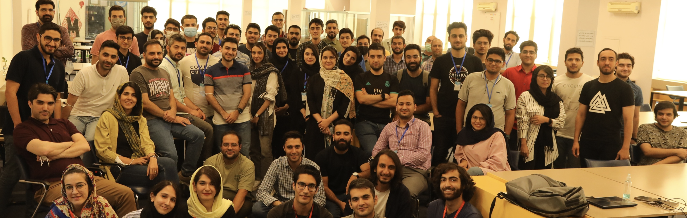

Group collaboration with 7 other mentors for educating 80 students during 14 data science workshops. ([LinkedIn](https://www.linkedin.com/company/ut-openai-summerschool/), [Github](https://github.com/HooshBaaz/2022_DataAnalytics_SummerSchool))

<iframe width="560" height="315" src="https://www.youtube.com/embed/qPlnH-qpHmo?si=B4_4AyphB02F7Za4" title="YouTube video player" frameborder="0" allow="accelerometer; autoplay; clipboard-write; encrypted-media; gyroscope; picture-in-picture; web-share" allowfullscreen></iframe>
