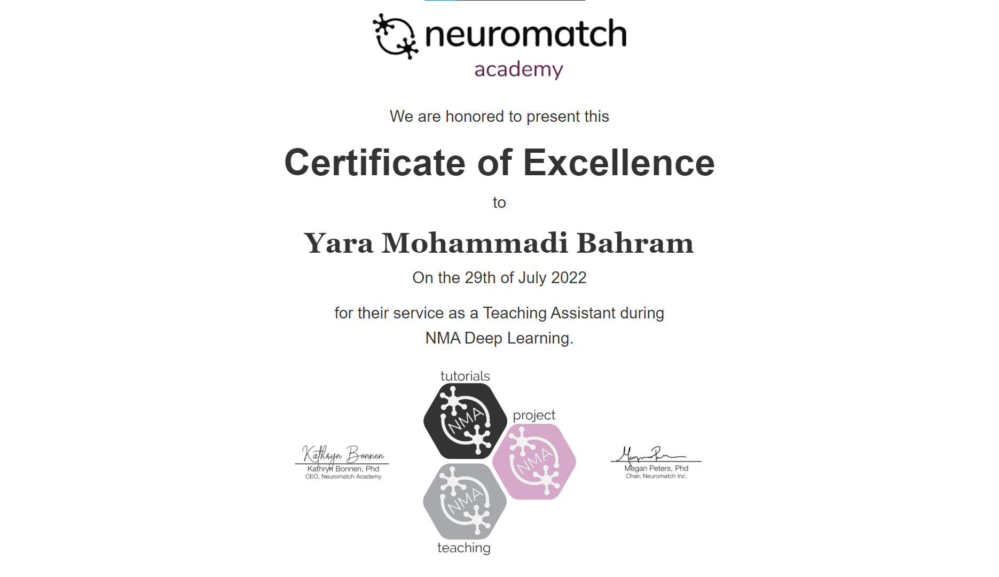
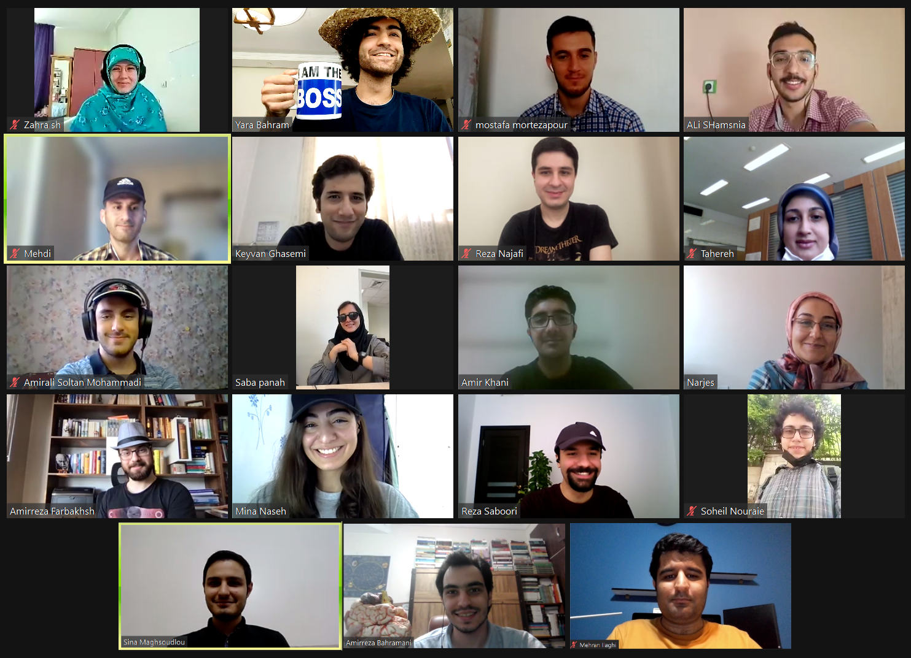

I was selected as TA for full-time supervision on the learning of 16 students from
different countries, and leading 2 research group projects during 3 weeks. The topics covered a wide and comprehensive range of Deep Learning subjects ([Curriculum](https://deeplearning.neuromatch.io/tutorials/intro.html)).

